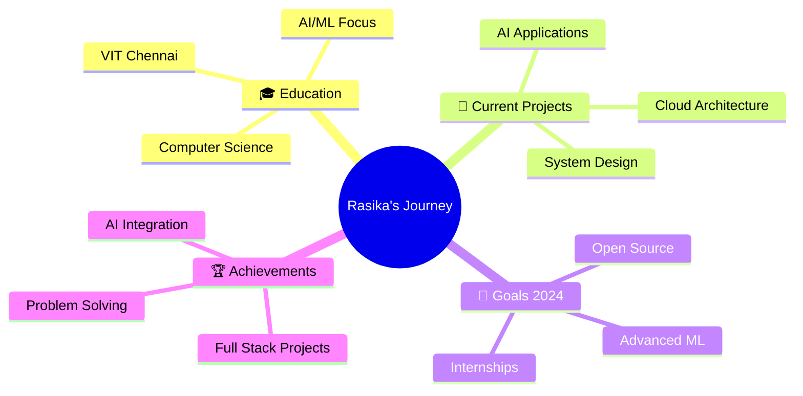

# 🚀 Rasika Phutane | Code Architect & AI Innovator

<div align="center">
  
  

  
  
</div>

---

## 🎮 Developer Stats Dashboard

<div align="center">
  
  
  
  

</div>

<div align="center">
  
  
  
  

</div>

---

## 🧬 Digital DNA Sequence

```python
class RasikaPhutane:
    def __init__(self):
        self.name = "Rasika Phutane"
        self.role = "CS Student @ VIT Chennai"
        self.language_stack = ["Python", "JavaScript", "SQL", "HTML/CSS"]
        self.architecture = ["FastAPI", "Flask", "React", "TensorFlow"]
        self.database = ["MySQL", "PostgreSQL", "MongoDB"]
        self.current_focus = "AI/ML & System Design"
        self.fun_fact = "I debug with coffee and create with curiosity ☕"
        
    def say_hi(self):
        print("Thanks for dropping by! Let's build something amazing together 🚀")
        
    def current_mission(self):
        return {
            "learning": ["Machine Learning", "Cloud Architecture", "Advanced Algorithms"],
            "building": ["AI-powered applications", "Scalable web solutions"],
            "exploring": ["Computer Vision", "NLP", "Distributed Systems"]
        }

me = RasikaPhutane()
me.say_hi()
```

---

## 🛠️ Tech Arsenal & Power Levels

<div align="center">

### 💻 Programming Languages


### 🚀 Frameworks & Libraries


### 🗄️ Databases & Tools


</div>

---

## 🏆 Featured Projects Showcase

<div align="center">
  
  <table>
    <tr>
      <td width="50%">
        <h3 align="center">🔍 GitHub Productivity Tracker</h3>
        <div align="center">
          <a href="https://github.com/rasikaphutane/github_productivity_tracking_chrome_extension" target="_blank">
            
          </a>
          <br><br>
          <p>
            
            
            
          </p>
          <p><strong>🎯 Chrome extension combining web development with AI sentiment analysis for developer productivity insights</strong></p>
        </div>
      </td>
      <td width="50%">
        <h3 align="center">🏥 Hospital Management System</h3>
        <div align="center">
          <a href="https://github.com/rasikaphutane/hospital-management" target="_blank">
            
          </a>
          <br><br>
          <p>
            
            
            
          </p>
          <p><strong>🎯 Comprehensive healthcare management application with scalable architecture and advanced user authentication</strong></p>
        </div>
      </td>
    </tr>
  </table>
  
</div>

---

## 📊 Coding Activity Heatmap

<div align="center">
  
  
  
</div>

---

## 🎯 Current Quest & Achievements

<div align="center">



</div>

---

## 📈 Skill Progression Game

<div align="center">

| Skill | Level | Progress | Next Milestone |
|-------|-------|----------|----------------|
| 🐍 Python | Expert | ████████████████████ 90% | Advanced Algorithms |
| ⚛️ React | Advanced | ████████████████ 80% | Next.js Mastery |
| 🤖 Machine Learning | Advanced | ████████████████ 75% | Deep Learning |
| 🚀 FastAPI | Advanced | ████████████████ 85% | Microservices |
| 🗄️ SQL | Expert | ████████████████████ 88% | Database Optimization |
| 🐳 Docker | Intermediate | ████████████ 65% | Kubernetes |

</div>

---

## 🌟 Fun Interactive Elements

<div align="center">

### 🎮 Profile Views Counter


### 🏆 GitHub Trophies


### ⚡ Random Dev Quote


</div>

---

## 🤝 Let's Connect & Build Together!

<div align="center">

### 📬 Reach Out
[](https://www.linkedin.com/in/rasikaphutane)
[](mailto:rasikaphutane18@gmail.com)
[](https://github.com/rasikaphutane)

### 💡 Open for Collaboration
- 🔥 AI/ML Projects
- 🌐 Full-Stack Applications
- 🚀 Open Source Contributions
- 💼 Internship Opportunities
- 📚 Learning & Growth

</div>

---

<div align="center">

### 🎊 Thanks for visiting my digital space!


*"Code is poetry written in logic, and every bug is just a plot twist in the story."* ✨


</div>

---

<!-- Easter Egg: If you've read this far, you're awesome! Drop me a message with "🎯 Easter Egg Found" and let's connect! -->
