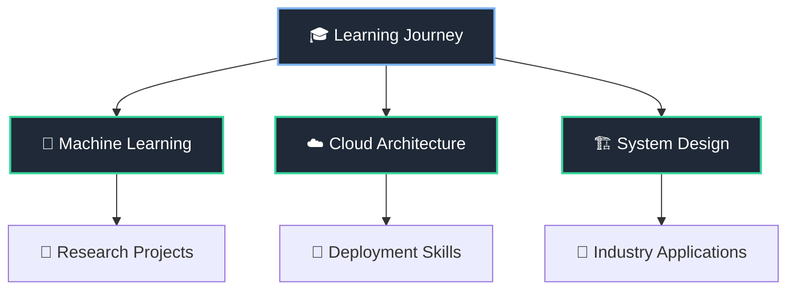

<div align="center">

# ✦ Rasika Phutane ✦

```
     ╭─────────────────────────────────────╮
     │  🌌 Digital Architect & Code Explorer │
     ╰─────────────────────────────────────╯
```


</div>

---

<div align="center">

## ⚡ Tech Stack Universe

<table>
<tr>
<td align="center" width="96">

<br>Python
</td>
<td align="center" width="96">

<br>JavaScript
</td>
<td align="center" width="96">

<br>React
</td>
<td align="center" width="96">

<br>FastAPI
</td>
<td align="center" width="96">

<br>Flask
</td>
</tr>
<tr>
<td align="center" width="96">

<br>MySQL
</td>
<td align="center" width="96">

<br>TensorFlow
</td>
<td align="center" width="96">

<br>Git
</td>
<td align="center" width="96">

<br>Docker
</td>
<td align="center" width="96">

<br>Linux
</td>
</tr>
</table>

</div>

---

<div align="center">

## 🛸 Featured Expeditions

<table>
<tr>
<td width="50%">

### 🔧 GitHub Productivity Tracker
*Chrome Extension*

```
┌─ Project Details ─────────────────┐
│ Type: Browser Extension           │
│ Tech: FastAPI + Chrome APIs       │
│ Feature: AI Sentiment Analysis    │
│ Purpose: Developer Insights       │
└───────────────────────────────────┘
```

<details>
<summary>🌟 <strong>Mission Overview</strong></summary>
<br>
A sophisticated Chrome extension that transforms GitHub activity tracking into actionable insights. Features intelligent pattern recognition, productivity scoring, and AI-powered sentiment analysis of commits and interactions.

**Key Features:**
- Real-time activity monitoring
- Productivity metrics dashboard  
- AI sentiment analysis engine
- Custom notification system
</details>

<a href="https://github.com/rasikaphutane/github_productivity_tracking_chrome_extension">

</a>

</td>
<td width="50%">

### 🤖 Business Query Bot
*AI-Powered Assistant*

```
┌─ Project Details ─────────────────┐
│ Type: AI Chat Interface           │
│ Tech: NLP + Machine Learning      │
│ Feature: Business Intelligence    │
│ Purpose: Query Resolution         │
└───────────────────────────────────┘
```

<details>
<summary>🌟 <strong>Mission Overview</strong></summary>
<br>
An intelligent conversational AI system designed to handle business queries with contextual understanding. Leverages natural language processing to provide accurate, relevant responses for enterprise environments.

**Key Features:**
- Natural language understanding
- Context-aware responses
- Business domain expertise
- Scalable architecture
</details>

<a href="https://github.com/rasikaphutane/business-query-bot">

</a>

</td>
</tr>
</table>

</div>

---

<div align="center">

## 📊 Mission Analytics


</div>

---

<div align="center">

## 🌌 Current Exploration



</div>

---

<div align="center">

## 🛰️ Transmission Channels

<table>
<tr>
<td align="center">
<a href="https://www.linkedin.com/in/rasikaphutane">

</a>
</td>
<td align="center">
<a href="mailto:rasikaphutane18@gmail.com">

</a>
</td>
<td align="center">
<a href="https://github.com/rasikaphutane">

</a>
</td>
</tr>
</table>

---

```
     ╭─────────────────────────────────────╮
     │   ✦ Ready for Collaborative Missions ✦   │
     ╰─────────────────────────────────────╯
```


</div>
